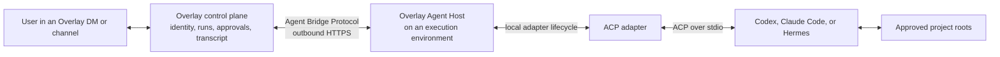
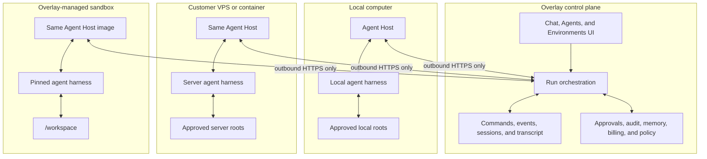
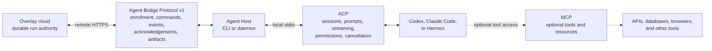
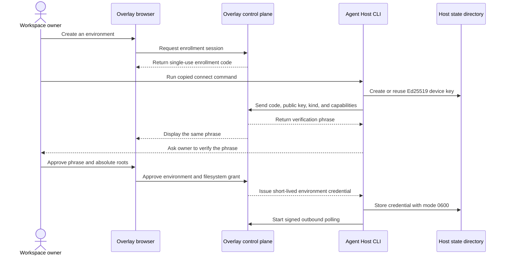
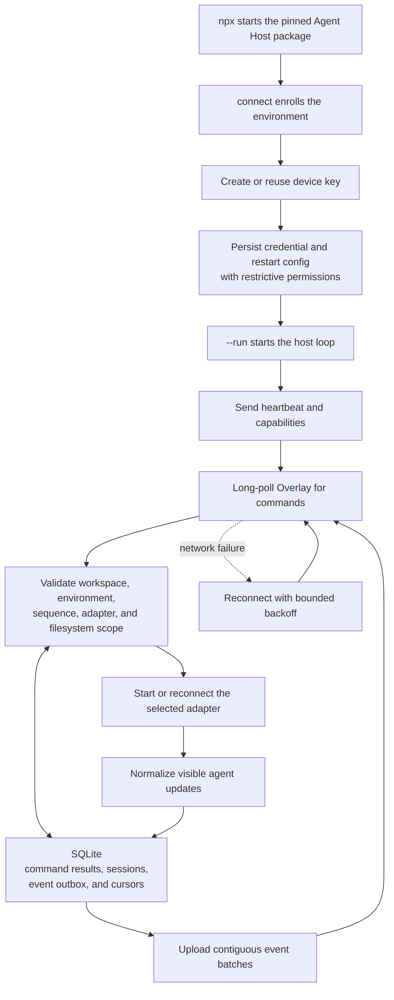
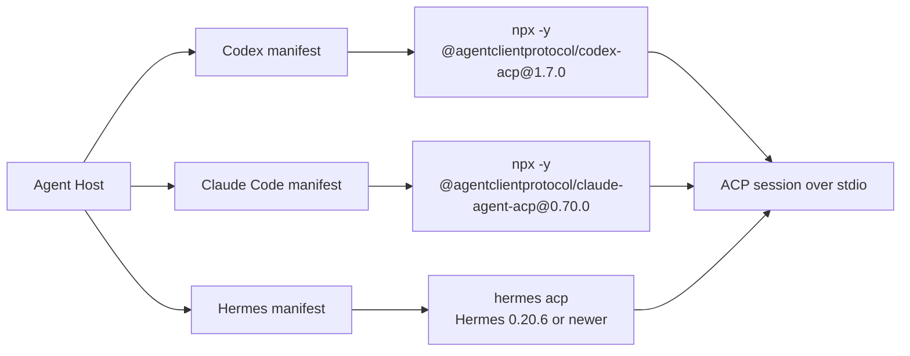
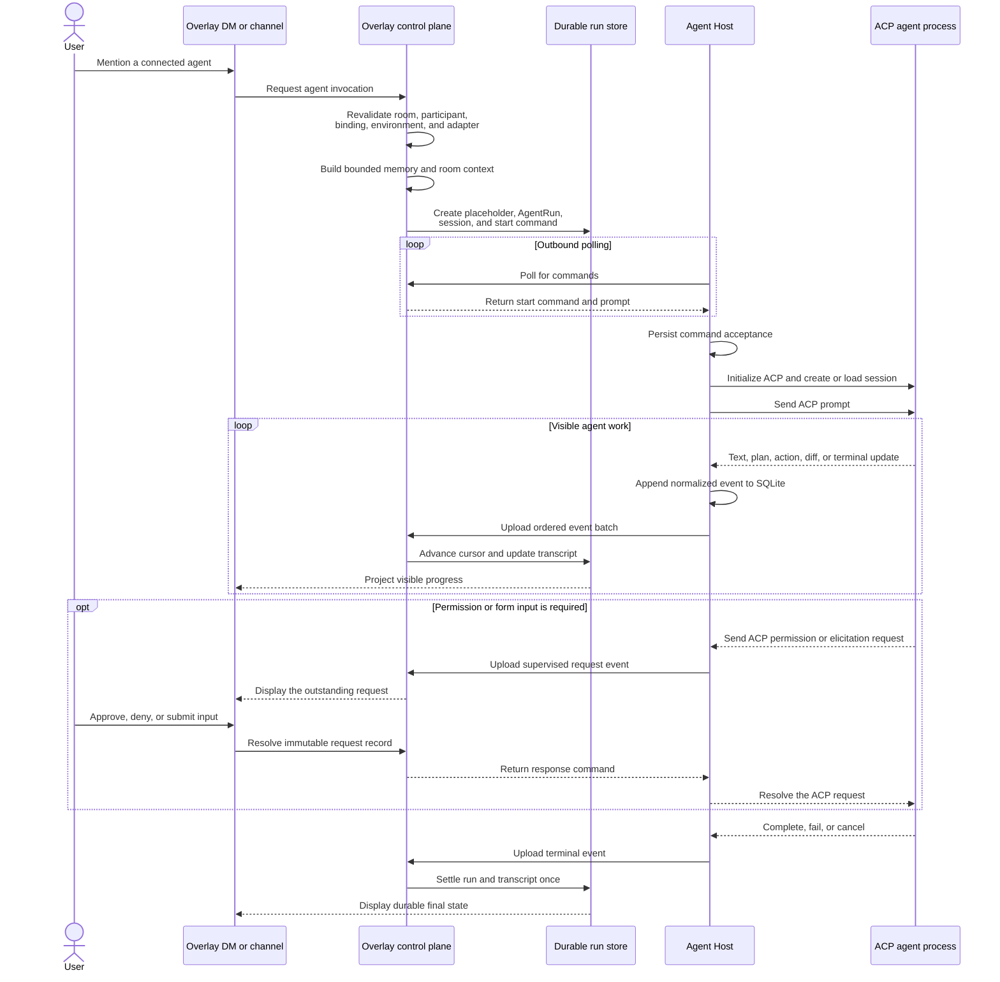
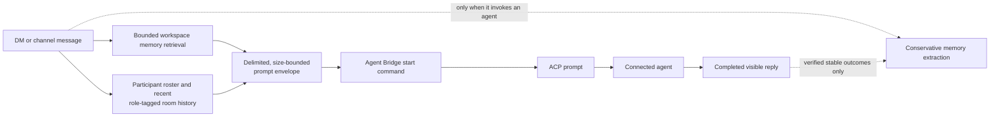

# Bring Your Own Agents architecture

Overlay uses one connected-agent architecture across user-owned computers, customer VPSs,
containers, and managed sandboxes. Overlay owns the durable run and user-facing controls. An
outbound-only Agent Host on the execution environment translates Overlay commands into local agent
sessions.

This page is the visual companion to the policy and implementation source of truth in
[Bring Your Own Agents](./bring-your-own-agents.md). Use that document for rollout gates, retention,
billing, provider parity, and the full threat model.

## Mental model

Overlay is the control plane, the Agent Host is the bridge, and the selected harness performs the
work.



The browser does not connect directly to the machine. The coding agent does not need an inbound
public endpoint. The Agent Host initiates every network connection to Overlay.

## Execution environments use the same host

An environment is an execution boundary, not an agent and not a folder. One environment can
advertise several adapters and support several agent bindings. Filesystem authority is a separate,
explicit grant.



The environment kinds are `local`, `vps`, `overlay_cloud`, and `external`. Overlay Cloud uses the
same enrollment, credential, polling, and adapter path as a user-owned host. Its provider-specific
lifecycle remains behind `@overlay/sandbox-runtime`.

Selected roots restrict valid working directories and the roots advertised to ACP. They are not an
operating-system sandbox. Use a restricted OS account, container, VM, or managed sandbox when the
harness requires strict isolation.

## The bridge protocol, ACP, and MCP have different jobs

The architecture uses three protocol layers. Only the Agent Bridge Protocol crosses the public
network between Overlay and the execution environment.



The protocol responsibilities are:

| Layer | Responsibility | Not responsible for |
| --- | --- | --- |
| Agent Bridge Protocol | Durable remote commands, normalized events, enrollment, request signing, acknowledgement, and replay boundaries. | Starting an agent process. |
| ACP | Local agent session creation and loading, prompts, streamed updates, permissions, elicitation, authentication, and cancellation. | Overlay workspace identity, billing, or remote durability. |
| MCP | Optional tool and resource access used by an agent. | The connected-agent execution lifecycle. |

## Enrollment connects a machine without opening an inbound port

A workspace owner or admin creates a ten-minute, single-use enrollment code in Overlay. The Agent
Host proves possession of its device key, and the browser confirms the same short verification
phrase before approving filesystem roots.



Initial enrollment uses a one-time challenge and Ed25519 proof. Subsequent host requests use a
short-lived bearer credential plus a signature that binds the method, path and query, body hash,
timestamp, nonce, and credential hash. Revocation disables bindings, stops new claims, and revokes
active credentials.

## The command-line package is a durable bridge process

Overlay generates one harness-specific command. For a local Codex environment, the command has
this shape:

```sh
npx --yes --package node@24 --package @layernorm/overlay-agent-host@0.3.2 \
  overlay-agent-host connect <enrollment-code> \
  --server https://getoverlay.io \
  --kind local \
  --adapter codex \
  --run
```

For Hermes on a VPS, use `--kind vps --adapter hermes`. The package requires Node.js 24 or newer.
The generated command installs and launches both the pinned Node 24 runtime and host package, so a
machine-wide Node 22 installation does not silently run unsupported code. `connect` enrolls the
environment, saves a mode-0600 restart config beside the private connection state, and `--run`
keeps the host in the foreground after approval.



The host stores accepted command results, remote session identifiers, adapter state, cursors, and
unacknowledged events in SQLite. A restart therefore does not duplicate accepted work or discard
unacknowledged visible output. The same executable can run in the foreground, as a per-user macOS
LaunchAgent installed through `service install`, under `systemd`, or as the default process in the
Agent Host container. The macOS service pins both Node and package versions, preserves state when
Terminal closes, and records the installation shell's executable search path plus common user-bin
locations so locally installed adapter CLIs remain discoverable under `launchd`.

## Built-in adapters start exact ACP processes

The Agent Host uses data-only manifests for the first three coding-agent adapters.



For each run, the ACP adapter spawns the process in the validated working directory, initializes
ACP, creates or loads a session, and sends the prompt. It converts ACP message chunks, plans, tool
calls, diffs, terminal references, permissions, elicitations, completion, and failure into the
normalized Agent Bridge Protocol.

Hermes uses its official `hermes acp` server. Overlay does not translate Hermes through a private
protocol. OpenClaw and other native adapters require the unchanged host conformance suite when ACP
is unavailable. A custom ACP command can be described through explicit adapter configuration, but
the product-supported built-in manifests remain Codex, Claude Code, and Hermes.

## An agent mention becomes one durable remote run

Overlay revalidates the room, participant, agent binding, environment, filesystem scope, and
advertised adapter before dispatch. It creates the assistant placeholder, remote `AgentRun`, remote
session, and start command in one provider transaction.



The host writes each normalized event to its outbox before upload. Overlay accepts contiguous event
sequences, advances the remote cursor, and updates the existing assistant message transactionally.
Duplicate terminal batches receive the existing acknowledgement instead of creating a second
message or settling a run twice.

If the host goes offline before claiming interactive work, Overlay persists a visible failed-to-start
assistant row with reconnection guidance instead of leaving the human message unanswered. The
environment list treats an `online` status as stale after 45 seconds without a heartbeat and refreshes
while the settings surface is open. Reconnection resumes from acknowledged command and event cursors.
Durable HTTP polling remains authoritative even if a future transport optimizes latency.

## Memory is assembled by Overlay before ACP receives the prompt

Agent DMs and channels use the same per-message memory policy for hosted and connected agents.
Memory is an Overlay context service, not an ACP persistence feature.



Memory defaults on only when an agent participates in the room. Turning memory off for a message
disables recall and extraction for that turn. Ordinary human-only room chatter is not silently
ingested. Human extraction can use bounded prior messages from the same human, and agent extraction
can use bounded prior messages from the exact agent principal; neither path imports other room
participants' messages into the extraction model.

## Package boundaries and naming

The npm organization scope identifies the publisher, the product segment identifies Overlay, and
the final segment identifies the component.

```text
Organization scope     Product       Component
@layernorm            /overlay      -agent-host
@layernorm            /overlay      -agent-bridge-protocol
```

Public packages follow `@layernorm/<product>-<component>`. Internal workspace-only packages can
continue using `@overlay/*`.

| Package or system | Responsibility |
| --- | --- |
| `@layernorm/overlay-agent-bridge-protocol` | Public versioned schemas, request proofs, limits, commands, events, and acknowledgements. It does not start agents. |
| `@layernorm/overlay-agent-host` | Public CLI and daemon that runs on a local computer, VPS, container, or managed sandbox. |
| ACP adapter inside the Agent Host | Starts and communicates with the selected local agent process. |
| Codex, Claude Code, or Hermes | Performs the actual coding and tool work. |
| `@overlay/agent-runtime` | Internal server-side helpers for Overlay-hosted turns. It is not the BYOA CLI. |
| `@overlay/workspace-contracts` | Internal adapter identifiers and connected-agent domain contracts. |
| `@overlay/sandbox-runtime` | Provider-neutral lifecycle for Vercel and Daytona managed sandboxes. |
| Overlay control plane | Workspace identity, authorization, bindings, runs, approvals, audit, transcript, memory, billing, and artifacts. |

The product-qualified public names begin with the lockstep `0.3.0` release; the PATH-safe host and
matching protocol ship together as `0.3.2`. The host depends on the
exact matching protocol version. The release workflow publishes the protocol first, then the host,
and only after both succeed does it deprecate the shorter `0.2.0` names with migration guidance.

## Trust boundaries

Overlay owns workspace identity, authorization, run state, commands, approvals, audit, billing,
artifact policy, and transcript projection. The host owns only its device private key, local SQLite
state, adapter state, and remote harness session identifiers.

Treat host text, tool state, metadata, and artifacts as hostile input. The server validates protocol
versions, sizes, sequences, schemas, checksums, workspace scope, and authorization before projecting
anything into a conversation. The bridge transports visible results and concise action state, not
private chain of thought.

## Current rollout boundary

The local and VPS host architecture and the Codex, Claude Code, and Hermes ACP manifests are
implemented. The managed-sandbox implementation uses the same host image and protocol, but Overlay
Cloud remains unavailable in the ordinary product UI until its image, conformance, credential,
egress, billing, cleanup, security-review, and stability gates are complete.

The server controls connected agents through independent, default-off feature flags and a separate
workspace rollout stage. Enabling one flag does not implicitly enable its prerequisites. See
[Bring Your Own Agents](./bring-your-own-agents.md#rollout-flags) before changing availability in
staging or production.

## Implementation map

Use these files when tracing or changing the architecture:

| Area | Source |
| --- | --- |
| Release policy, rollout, threat model, and retention | [`docs/develop/bring-your-own-agents.md`](./bring-your-own-agents.md) |
| Agent Host CLI and runtime | `packages/overlay-agent-host` |
| ACP process bridge | `packages/overlay-agent-host/src/acp-adapter.ts` |
| Built-in manifests | `packages/overlay-agent-host/src/adapter-manifests.ts` |
| Remote bridge schemas | `packages/overlay-agent-bridge-protocol` |
| Generated enrollment command | `src/server/agents/agent-enrollment-command.ts` |
| Remote dispatch and transcript projection | `src/server/agents` |
